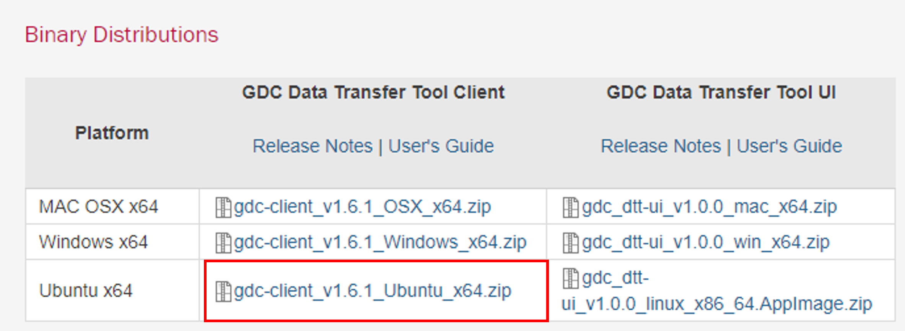
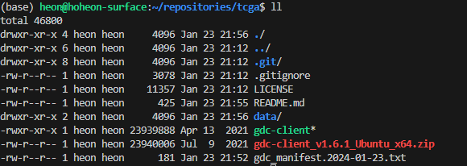
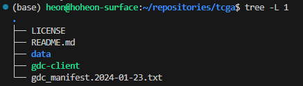

# tcga
The Cancer Genome Atlas

#### 설치방법
1. GDC(Genomic Data Commons) data transfer tool 홈페이지로 접속합니다.
URL: https://gdc.cancer.gov/access-data/gdc-data-transfer-tool

2. 아래의 binary distribution의 주소를 복사합니다.


3. wget으로 다운로드 받습니다.
```/bin/bash
$ wget https://gdc.cancer.gov/files/public/file/gdc_dtt-ui_v1.0.0_linux_x86_64.AppImage.zip
```

4. 압축을 해제합니다.
```
$ unzip gdc-client_v1.6.1_Ubuntu_x64.zip
```

5. 아래와 같이 실행가능한 바이너리 파일이 있음을 확인합니다.



#### 다운로드
1. file manifest 을 이용한 다운로드 방법
- 아래와 같이 file manifest을 GDC에서 다운로드 받아 실행합니다.
```/bin/bash
$ cat gdc_manifest.2024-01-23.txt
83328170-e482-48b7-b972-fe82423434eb    TCGA-C8-A26W-01Z-00-DX1.CFF07941-6CD1-4CF9-BE5F-387DA67B66CC.svs        6aa4690a9fb3cf230d75716e568a1c8d        1319308613      released(base)

$ ./gdc-client download -m gdc_manifest.2024-01-23.txt 
```



2. FILE UUID을 이용한 다운로드 방법
- 아래와 같이 file의 UUID을 GDC에서 한 행을 클릭하여 확인할 수 있다면, 다음의 명령어로 다운로드 받을 수 있습니다.


Reference: https://docs.gdc.cancer.gov/Data_Transfer_Tool/Users_Guide/Data_Download_and_Upload/